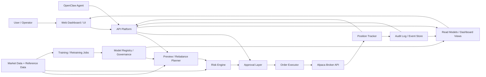
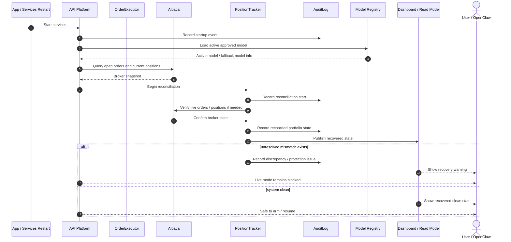

# Architecture and Sequence Diagrams

This document provides the final visual layer for the split specification set.

It includes:

- system architecture diagram
- trade request sequence diagram
- startup/recovery sequence diagram

These diagrams are intended to align with:

- Spec A — Core Trading Engine
- Spec B — Web / API Platform
- Spec C — OpenClaw Agent Contract and Permissions
- Implementation Phases and Acceptance Criteria

---

## 1. System architecture diagram



### Reading the architecture

- **User / Operator** interacts mainly through the web dashboard
- **OpenClaw Agent** interacts through the API contract
- **Preview / Rebalance Planner** converts intent into allocation-aware execution previews
- **Risk Engine** applies sizing, sector/correlation, freshness, and governance constraints
- **Approval Layer** gates execution when approval is required
- **Order Executor** is the single writer to the broker
- **Position Tracker** reconciles orders, fills, and portfolio state
- **Audit Log / Event Store** records intent, approval, execution, reconciliation, and model events
- **Model Registry / Governance** manages model versioning, promotion, rollback, and fallback
- **Dashboard Views** present read-only operational state to the UI

---

## 2. Trade request sequence diagram

This is the main execution-oriented sequence implied by the spec.

```mermaid
sequenceDiagram
    autonumber
    actor Actor as OpenClaw / User
    participant API as API Platform
    participant Risk as Risk Engine
    participant Preview as Preview Engine
    participant Approval as Approval Layer
    participant Exec as OrderExecutor
    participant Broker as Alpaca
    participant Tracker as PositionTracker
    participant Audit as AuditLog
    participant Dash as Dashboard / Read Model

    Actor->>API: Submit trade / rebalance intent
    API->>Audit: Record intent received
    API->>Risk: Pre-check request context
    Risk-->>API: Context accepted or blocked

    alt blocked early
        API->>Audit: Record rejection reason
        API->>Dash: Publish rejected intent
        API-->>Actor: Reject / explain why
    else accepted for preview
        API->>Preview: Build preview
        Preview->>Risk: Run risk + concentration + freshness checks
        Risk-->>Preview: Risk results
        Preview-->>API: Preview package
        API->>Audit: Record preview generated
        API-->>Actor: Show preview

        alt approval required
            Actor->>API: Approve preview
            API->>Approval: Validate approval action
            Approval->>Audit: Record approval
            Approval->>Exec: Release approved intent
        else auto-approved policy
            API->>Approval: Auto-approve by policy
            Approval->>Audit: Record auto-approval
            Approval->>Exec: Release approved intent
        end

        Exec->>Audit: Record submission start
        Exec->>Broker: Submit / modify / cancel orders
        Broker-->>Exec: Order accepted / rejected / partial fill / fill
        Exec->>Tracker: Forward execution updates
        Tracker->>Audit: Record position/order state changes
        Tracker->>Dash: Update portfolio and order views
        Dash-->>Actor: Show live status
    end
```

### What this sequence clarifies

- intent enters through the API, not directly to the broker
- preview happens before execution
- risk checks happen before approval/execution
- approval is an explicit step when policy requires it
- OrderExecutor is the **single writer** to Alpaca
- PositionTracker and AuditLog close the loop for dashboard visibility

---

## 3. Startup / recovery sequence diagram

This diagram covers restart, reconnect, or crash recovery.



### What this sequence clarifies

- startup loads the **active approved model**, not simply the newest trained model
- broker state is re-queried before live actions resume
- reconciliation happens before the system is considered safe
- live mode can remain blocked until discrepancies are resolved

---

## 4. Recommended implementation note

For builders using Windsurf, Claude Code, or OpenClaw-assisted generation:

- treat the architecture diagram as the component map
- treat the trade request sequence as the main execution path
- treat the startup/recovery sequence as the resiliency path

These three diagrams should be implemented as the visual backbone of the full system spec.
